<h3>
<code>saksham@github ~ $ ./contributions.sh</code>
</h3>

 
 

<h3>
<code>saksham@github ~ $ whoami</code>
</h3>

<table>
<tr>

<td valign="top">

</td>

<td valign="top">

</td>

</tr>
</table>

 

<h3>
<code>saksham@github ~ $ links</code>
</h3>

<a href="https://www.linkedin.com/in/saksham-kumar-66b410264/">
LinkedIn
</a>

&nbsp; · &nbsp;

<a href="https://github.com/Saksham1136?tab=repositories">
Projects
</a>

&nbsp; · &nbsp;

<a href="https://github.com/Saksham1136">
GitHub
</a>

 
 

AI/ML · Generative AI · Agentic AI · RAG · LangGraph

